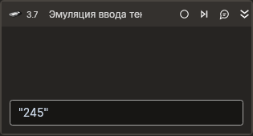

# Эмуляция ввода текста



Компонент, производящая симуляцию ввода текста на клавиатуре. Компонент корректно работает только внутри контейнера Присоединиться к приложению.

## Свойства
| Свойство  | Тип    | Описание                                           |
| --------- | ------ | -------------------------------------------------- |
| Текст\*   | String | Вводимый текст                                     |
| Пауза\*   | Int32  | Пауза между нажатиями кнопок (мс)                  |
| Таймаут\* | Int32  | Предельное время ожидания завершения процесса (мс) |

## Только код  
Пример использования элемента в процессе с типом **Только код** (Pure code):
> Для работы с примером необходимо установить приложение **mate-calc**.



```csharp
LTools.Desktop.DesktopApp app = LTools.Desktop.DesktopApp.Init(wf, null, "Калькулятор", 20000, true, LTools.Desktop.Model.DesktopTypes.UIAUTOMATION);
app.SetFocus("{\"WinName\":null,\"WinPath\":null,\"WinId\":null,\"AppName\":null,\"TextSearchMode\":0,\"Items\":[{\"Role\":\"editbar\",\"Items\":[]}]}");
LTools.Desktop.DesktopApp.TypeSimulate(wf, "12345", 200, 20000);
```



```python
app = LTools.Desktop.DesktopApp.Init(wf, None, "Калькулятор", 20000, True, LTools.Desktop.Model.DesktopTypes.UIAUTOMATION)
app.SetFocus("{\"WinName\":null,\"WinPath\":null,\"WinId\":null,\"AppName\":null,\"TextSearchMode\":0,\"Items\":[{\"Role\":\"editbar\",\"Items\":[]}]}")
LTools.Desktop.DesktopApp.TypeSimulate(wf, "12345", 200, 20000)
```



```javascript
var app = _lib.LTools.Desktop.DesktopApp.Init(wf, null, "Калькулятор", 20000, true, _lib.LTools.Desktop.Model.DesktopTypes.UIAUTOMATION);
app.SetFocus("{\"WinName\":null,\"WinPath\":null,\"WinId\":null,\"AppName\":null,\"TextSearchMode\":0,\"Items\":[{\"Role\":\"editbar\",\"Items\":[]}]}");
_lib.LTools.Desktop.DesktopApp.TypeSimulate(wf, "12345", 200, 20000);
```


