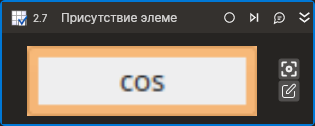

# Присутствие элемента



Компонент, производящий поиск элемента управления. Компонент корректно работает только внутри контейнера Присоединиться к приложению.

## Свойства
| Свойство        | Тип                             | Описание                                             |
| --------------- | ------------------------------- | ---------------------------------------------------- |
| Шаблон поиска\* | String                          | Шаблон поиска элемента управления                    |
| Элемент         | LTools.Desktop.Model.DUIControl | Переменная для хранения ссылки на элемент управления |
| Элементы        | List<LTools.Desktop.Model.DUIControl> | Переменная для хранения ссылки на элементы управления |
| Результат       | Boolean                         | Переменная, хранящая результаты поиска               |
| Таймаут\*       | Int32                           | Предельное время ожидания завершения процесса (мс)   |

## Только код
Пример использования элемента в процессе с типом **Только код** (Pure code):
> - Для работы с примером необходимо установить приложение **mate-calc**.
> - Для демонстрации `Исчезновения элемента` необходимо переключиться из режима калькулятора `Простой` в режим `Расширенный` во время запуска примера (конопка `cos` должна появиться).



```csharp
LTools.Desktop.DesktopApp app = LTools.Desktop.DesktopApp.Init(wf, null, "Калькулятор", 20000, true, LTools.Desktop.Model.DesktopTypes.UIAUTOMATION);
LTools.Desktop.Model.DUIControl el = app.FindElement("{\"WinName\":null,\"WinPath\":null,\"WinId\":null,\"AppName\":\"mate-calc\",\"TextSearchMode\":0,\"Items\":[{\"Name\":\"cosine\",\"Role\":\"push button\",\"Items\":[]}]}");
```



```python
app = LTools.Desktop.DesktopApp.Init(wf, None, "Калькулятор", 20000, True, LTools.Desktop.Model.DesktopTypes.UIAUTOMATION)
el = app.FindElement("{\"WinName\":null,\"WinPath\":null,\"WinId\":null,\"AppName\":\"mate-calc\",\"TextSearchMode\":0,\"Items\":[{\"Name\":\"cosine\",\"Role\":\"push button\",\"Items\":[]}]}");
```



```javascript
var app = _lib.LTools.Desktop.DesktopApp.Init(wf, null, "Калькулятор", 20000, true, _lib.LTools.Desktop.Model.DesktopTypes.UIAUTOMATION);
var el = app.FindElement("{\"WinName\":null,\"WinPath\":null,\"WinId\":null,\"AppName\":\"mate-calc\",\"TextSearchMode\":0,\"Items\":[{\"Name\":\"cosine\",\"Role\":\"push button\",\"Items\":[]}]}");
```


