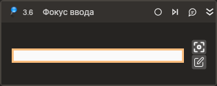

# Фокус ввода



Компонент, устанавливающий фокус ввода на выбранном элементе управления. Компонент корректно работает только внутри контейнера Присоединиться к приложению.

## Свойства
| Свойство      | Тип                             | Описание                                           |
| ------------- | ------------------------------- | -------------------------------------------------- |
| Шаблон поиска | String                          | Шаблон поиска элемента управления                  |
| Элемент       | LTools.Desktop.Model.DUIControl | Ссылка на элемент управления                       |
| Таймаут\*     | Int32                           | Предельное время ожидания завершения процесса (мс) |

## Только код  
Пример использования элемента в процессе с типом **Только код** (Pure code):
> Для работы с примером необходимо установить приложение **mate-calc**.



```csharp
LTools.Desktop.DesktopApp app = LTools.Desktop.DesktopApp.Init(wf, null, "Калькулятор", 20000, true, LTools.Desktop.Model.DesktopTypes.UIAUTOMATION);
//Шаблон поиска
app.SetFocus("{\"WinName\":null,\"WinPath\":null,\"WinId\":null,\"AppName\":null,\"TextSearchMode\":0,\"Items\":[{\"Role\":\"editbar\",\"Items\":[]}]}");
//Элемент
LTools.Desktop.Model.DUIControl el = app.FindElement("{\"WinName\":null,\"WinPath\":null,\"WinId\":null,\"AppName\":null,\"TextSearchMode\":0,\"Items\":[{\"Role\":\"editbar\",\"Items\":[]}]}");
app.SetFocus(el);
```



```python
app = LTools.Desktop.DesktopApp.Init(wf, None, "Калькулятор", 20000, True, LTools.Desktop.Model.DesktopTypes.UIAUTOMATION)
#Шаблон поиска
app.SetFocus("{\"WinName\":null,\"WinPath\":null,\"WinId\":null,\"AppName\":null,\"TextSearchMode\":0,\"Items\":[{\"Role\":\"editbar\",\"Items\":[]}]}")
#Элемент
el = app.FindElement("{\"WinName\":null,\"WinPath\":null,\"WinId\":null,\"AppName\":null,\"TextSearchMode\":0,\"Items\":[{\"Role\":\"editbar\",\"Items\":[]}]}")
app.SetFocus(el)
```



```javascript
var app = _lib.LTools.Desktop.DesktopApp.Init(wf, null, "Калькулятор", 20000, true, _lib.LTools.Desktop.Model.DesktopTypes.UIAUTOMATION);
//Шаблон поиска
app.SetFocus("{\"WinName\":null,\"WinPath\":null,\"WinId\":null,\"AppName\":null,\"TextSearchMode\":0,\"Items\":[{\"Role\":\"editbar\",\"Items\":[]}]}");
//Элемент
var el = app.FindElement("{\"WinName\":null,\"WinPath\":null,\"WinId\":null,\"AppName\":null,\"TextSearchMode\":0,\"Items\":[{\"Role\":\"editbar\",\"Items\":[]}]}");
app.SetFocus(el);
```


