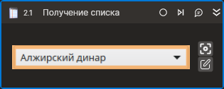

# Получение списка



Компонент, получающий значения из комбо-бокса либо списка.

## Свойства
| Свойство      | Тип                             | Описание                                           |
| ------------- | ------------------------------- | -------------------------------------------------- |
| Шаблон поиска | String                          | Шаблон поиска элемента управления                  |
| Элемент       | LTools.Desktop.Model.DUIControl | Ссылка на элемент управления                       |
| Значения      | List\<String>                   | Все значения списка                                |
| Выбранные     | List\<String>                   | Выбранные значения списка                          |
| Таймаут\*     | Int32                           | Предельное время ожидания завершения процесса (мс) |

## Только код  
Пример использования элемента в процессе с типом **Только код** (Pure code):
> - Для работы с примером необходимо установить приложение **mate-calc**.
> - Для демонстрации `Получение списка` необходимо переключиться в режим калькулятора `Финансовый`



```csharp
LTools.Desktop.DesktopApp app = LTools.Desktop.DesktopApp.Init(wf, null, "Калькулятор", 20000, true, LTools.Desktop.Model.DesktopTypes.UIAUTOMATION);
//Шаблон поиска + Весь список
List<string> lst = app.SelectGetItems("{\"WinName\":null,\"WinPath\":null,\"WinId\":null,\"AppName\":null,\"TextSearchMode\":0,\"Items\":[{\"Role\":\"combo box\",\"Items\":[]}]}");
//Элемент + Выбранные записи
LTools.Desktop.Model.DUIControl el = app.FindElement("{\"WinName\":null,\"WinPath\":null,\"WinId\":null,\"AppName\":null,\"TextSearchMode\":0,\"Items\":[{\"Role\":\"combo box\",\"Items\":[]}]}");
List<string> sel = app.SelectGetSelItems(el);
```



```python
app = LTools.Desktop.DesktopApp.Init(wf, None, "Test_*", 20000, True, LTools.Desktop.Model.DesktopTypes.UIAUTOMATION)
#Шаблон поиска + Весь список
lst = app.SelectGetItems("{\"WinName\":null,\"WinPath\":null,\"WinId\":null,\"AppName\":null,\"TextSearchMode\":0,\"Items\":[{\"Role\":\"combo box\",\"Items\":[]}]}")
#Элемент + Выбранные записи
el = app.FindElement("{\"WinName\":null,\"WinPath\":null,\"WinId\":null,\"AppName\":null,\"TextSearchMode\":0,\"Items\":[{\"Role\":\"combo box\",\"Items\":[]}]}")
sel = app.SelectGetSelItems(el)
```



```javascript
var app = _lib.LTools.Desktop.DesktopApp.Init(wf, null, "Test_*", 20000, true, _lib.LTools.Desktop.Model.DesktopTypes.UIAUTOMATION);
//Шаблон поиска + Весь список
var lst = app.SelectGetItems("{\"WinName\":null,\"WinPath\":null,\"WinId\":null,\"AppName\":null,\"TextSearchMode\":0,\"Items\":[{\"Role\":\"combo box\",\"Items\":[]}]}");
//Элемент + Выбранные записи
var el = app.FindElement("{\"WinName\":null,\"WinPath\":null,\"WinId\":null,\"AppName\":null,\"TextSearchMode\":0,\"Items\":[{\"Role\":\"combo box\",\"Items\":[]}]}");
var sel = app.SelectGetSelItems(el);
```


