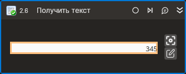

# Получить текст



Компонент, получающий текст выбранного элемента управления. Компонент корректно работает только внутри контейнера Присоединиться к приложению.

## Свойства  

Символ `*` в названии свойства указывает на обязательность заполнения. Описание общих свойств см. в разделе [Свойства элемента](https://docs.primo-rpa.ru/primo-rpa/primo-studio/process/elements#svoistva-elementa).

1. **Шаблон поиска** *[String]* - Шаблон поиска элемента управления  
1. **Элемент** *[LTools.Desktop.Model.DUIControl]* - Ссылка на элемент управления  
1. **Переменная\*** *[String]* - Переменная для хранения полученного текста  
1. **Таймаут\*** *[Int32]* - Предельное время ожидания завершения процесса (мс)  

## Только код
В настоящее время функциональность для использования данного элемента в процессах с типом **Только код** (Pure code) не реализована.



```csharp
//Функционал пока не реализован!!!
LTools.Desktop.DesktopApp app = LTools.Desktop.DesktopApp.Init(wf, null, "Test_*", 20000, true, LTools.Desktop.Model.DesktopTypes.UIAUTOMATION);
//Шаблон поиска
string txt = app.GetInnerText("{\"Name\":\"\",\"AutomationID\":\"txtbxSample\",\"ClassName\":\"TextBox\",\"AUIProperties\":[],\"TextSearchMode\":0,\"IsRoot\":false,\"IsQuickSearch\":false}");
//Элемент
LTools.Desktop.Model.DUIControl el = app.FindElement("{\"Name\":\"\",\"AutomationID\":\"txtbxSample\",\"ClassName\":\"TextBox\",\"AUIProperties\":[],\"TextSearchMode\":0,\"IsRoot\":false,\"IsQuickSearch\":false}");
txt = app.GetInnerText(el);
```



```python
#Функционал пока не реализован!!!
app = LTools.Desktop.DesktopApp.Init(wf, None, "Test_*", 20000, True, LTools.Desktop.Model.DesktopTypes.UIAUTOMATION)
#Шаблон поиска
txt = app.GetInnerText("{\"Name\":\"\",\"AutomationID\":\"txtbxSample\",\"ClassName\":\"TextBox\",\"AUIProperties\":[],\"TextSearchMode\":0,\"IsRoot\":false,\"IsQuickSearch\":false}")
#Элемент
el = app.FindElement("{\"Name\":\"\",\"AutomationID\":\"txtbxSample\",\"ClassName\":\"TextBox\",\"AUIProperties\":[],\"TextSearchMode\":0,\"IsRoot\":false,\"IsQuickSearch\":false}")
txt = app.GetInnerText(el)
```



```javascript
//Функционал пока не реализован!!!
var app = _lib.LTools.Desktop.DesktopApp.Init(wf, null, "Test_*", 20000, true, _lib.LTools.Desktop.Model.DesktopTypes.UIAUTOMATION);
//Шаблон поиска
var txt = app.GetInnerText("{\"Name\":\"\",\"AutomationID\":\"txtbxSample\",\"ClassName\":\"TextBox\",\"AUIProperties\":[],\"TextSearchMode\":0,\"IsRoot\":false,\"IsQuickSearch\":false}");
//Элемент
var el = app.FindElement("{\"Name\":\"\",\"AutomationID\":\"txtbxSample\",\"ClassName\":\"TextBox\",\"AUIProperties\":[],\"TextSearchMode\":0,\"IsRoot\":false,\"IsQuickSearch\":false}");
txt = app.GetInnerText(el);
```


