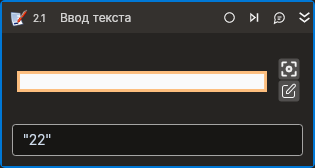

# Ввод текста



Компонент, производящий ввод текста в выбранный элемент управления. Компонент корректно работает только внутри контейнера Присоединиться к приложению.

## Свойства
| Свойство      | Тип                             | Описание                                           |
| ------------- | ------------------------------- | -------------------------------------------------- |
| Шаблон поиска | String                          | Шаблон поиска элемента управления                  |
| Элемент       | LTools.Desktop.Model.DUIControl | Ссылка на элемент управления                       |
| Текст\*       | String                          | Вводимый текст                                     |
| Таймаут\*     | Int32                           | Предельное время ожидания завершения процесса (мс) |

## Только код  
Пример использования элемента в процессе с типом **Только код** (Pure code):
> Для работы с примером необходимо установить приложение **mate-calc**



```csharp
LTools.Desktop.DesktopApp app = LTools.Desktop.DesktopApp.Init(wf, null, "Калькулятор", 10000, true, LTools.Desktop.Model.DesktopTypes.UIAUTOMATION);
//Шаблон поиска
app.TextInput("{\"WinName\":null,\"WinPath\":null,\"WinId\":null,\"AppName\":null,\"TextSearchMode\":0,\"Items\":[{\"Role\":\"editbar\",\"Items\":[]}]}", "11");
//Ссылка на элемент
LTools.Desktop.Model.DUIControl el = app.FindElement("{\"WinName\":null,\"WinPath\":null,\"WinId\":null,\"AppName\":null,\"TextSearchMode\":0,\"Items\":[{\"Role\":\"editbar\",\"Items\":[]}]}");
app.TextInput(el, "11");
```



```python
app = LTools.Desktop.DesktopApp.Init(wf, None, "Калькулятор", 10000, True, LTools.Desktop.Model.DesktopTypes.UIAUTOMATION)
#Шаблон поиска
app.TextInput("{\"WinName\":null,\"WinPath\":null,\"WinId\":null,\"AppName\":null,\"TextSearchMode\":0,\"Items\":[{\"Role\":\"editbar\",\"Items\":[]}]}", "11")
#Ссылка на элемент
el = app.FindElement("{\"WinName\":null,\"WinPath\":null,\"WinId\":null,\"AppName\":null,\"TextSearchMode\":0,\"Items\":[{\"Role\":\"editbar\",\"Items\":[]}]}")
app.TextInput(el, "11")
```



```javascript
let app = _lib.LTools.Desktop.DesktopApp.Init(wf, null, "Калькулятор*", 10000, true, _lib.LTools.Desktop.Model.DesktopTypes.UIAUTOMATION);
//Шаблон поиска
app.TextInput("{\"WinName\":null,\"WinPath\":null,\"WinId\":null,\"AppName\":null,\"TextSearchMode\":0,\"Items\":[{\"Role\":\"editbar\",\"Items\":[]}]}", "11");
//Ссылка на элемент
let el = app.FindElement("{\"WinName\":null,\"WinPath\":null,\"WinId\":null,\"AppName\":null,\"TextSearchMode\":0,\"Items\":[{\"Role\":\"editbar\",\"Items\":[]}]}");
app.TextInput(el, "11");
```


