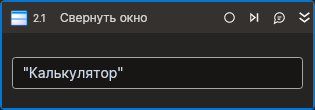

# Свернуть окно



Компонент, сворачивающий окно приложения. Компонент корректно работает только внутри контейнера Присоединиться к приложению.

## Свойства
| Свойство            | Тип    | Описание                                           |
| ------------------- | ------ | -------------------------------------------------- |
| Заголовок\*         | String | Заголовок окна                                     |
| Заголовок (RegEx)\* | String | Заголовок окна (регулярное выражение)              |

## Только код  
Пример использования элемента в процессе с типом **Только код** (Pure code):
> Для работы с примером необходимо установить приложение **mate-calc**.



```csharp
LTools.Desktop.DesktopApp app = LTools.Desktop.DesktopApp.Init(wf, null, "Калькулятор", 20000, true, LTools.Desktop.Model.DesktopTypes.UIAUTOMATION);
app.MinimizeWindow("Калькулятор");
```



```python
app = LTools.Desktop.DesktopApp.Init(wf, None, "Калькулятор", 20000, True, LTools.Desktop.Model.DesktopTypes.UIAUTOMATION)
app.MinimizeWindow("Калькулятор")
```



```javascript
var app = _lib.LTools.Desktop.DesktopApp.Init(wf, null, "Калькулятор", 20000, true, _lib.LTools.Desktop.Model.DesktopTypes.UIAUTOMATION);
app.MinimizeWindow("Калькулятор");
```


