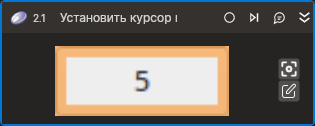

# Установить курсор мыши



Устанавливает курсор мыши на выбранном элементе управления или по координатам.

## Свойства  
| Свойство          | Тип                                | Описание                                                                                                            |
| ----------------- | ---------------------------------- | ------------------------------------------------------------------------------------------------------------------- |
| Шаблон поиска     | String                             | Шаблон поиска элемента управления                                                                                   |
| Элемент           | LTools.Desktop.Model.DUIControl    | Ссылка на элемент управления. Над этим элементом будет установлен курсор                                            |
| Координаты        | System.Drawing.Rectangle           | Координаты для установки курсора                                                                                    |
| Позиция           | LTools.Common.Model.ClickPositions | Позиция курсора при установке. Работает только при использовании параметра **Шаблон поиска** или **Элемент**. Значение по умолчанию - `Center`. Для того, чтобы изменить значение, щелкните на выпадающем списке. |
| Таймаут\*         | Int32                              | Предельное время ожидания завершения процесса (мс). По умолчанию 10000                                              |

> Существует три способа установить курсор мыши. С каждым из таких способов ассоциирован один из параметров: **Шаблон поиска**, **Элемент**, **Координаты**. Другими словами, может быть использован только один такой параметр.

## Только код  
Пример использования элемента в процессе с типом **Только код** (Pure code):
> Для работы с примером необходимо установить приложение **mate-calc**.



```csharp
LTools.Desktop.DesktopApp app = LTools.Desktop.DesktopApp.Init(wf, null, "Калькулятор", 20000, true, LTools.Desktop.Model.DesktopTypes.UIAUTOMATION);
//Шаблон поиска + Кнопка мыши + Клавиатура
app.MouseHover("{\"WinName\":null,\"WinPath\":null,\"WinId\":null,\"AppName\":\"mate-calc\",\"TextSearchMode\":0,\"Items\":[{\"Name\":\"5\",\"Role\":\"push button\",\"Items\":[]}]}",
    LTools.Common.Model.ClickPositions.TopLeft, 20000);
//Элемент
LTools.Desktop.Model.DUIControl el = app.FindElement("{\"WinName\":null,\"WinPath\":null,\"WinId\":null,\"AppName\":\"mate-calc\",\"TextSearchMode\":0,\"Items\":[{\"Name\":\"5\",\"Role\":\"push button\",\"Items\":[]}]}");
app.MouseHover(el, LTools.Common.Model.ClickPositions.Center);
//Координаты
app.MouseHover(new System.Drawing.Point(100, 150));
```



```python
app = LTools.Desktop.DesktopApp.Init(wf, None, "Калькулятор", 20000, True, LTools.Desktop.Model.DesktopTypes.UIAUTOMATION)
#Шаблон поиска + Кнопка мыши + Клавиатура
app.MouseHover("{\"WinName\":null,\"WinPath\":null,\"WinId\":null,\"AppName\":\"mate-calc\",\"TextSearchMode\":0,\"Items\":[{\"Name\":\"5\",\"Role\":\"push button\",\"Items\":[]}]}",
    LTools.Common.Model.ClickPositions.TopLeft, 20000)
#Элемент
el = app.FindElement("{\"WinName\":null,\"WinPath\":null,\"WinId\":null,\"AppName\":\"mate-calc\",\"TextSearchMode\":0,\"Items\":[{\"Name\":\"5\",\"Role\":\"push button\",\"Items\":[]}]}")
app.MouseHover(el, LTools.Common.Model.ClickPositions.Center)
#Координаты
app.MouseHover(System.Drawing.Point(100, 150))
```



```javascript
var app = _lib.LTools.Desktop.DesktopApp.Init(wf, null, "Калькулятор", 20000, true, _lib.LTools.Desktop.Model.DesktopTypes.UIAUTOMATION);
//Шаблон поиска + Кнопка мыши + Клавиатура
app.MouseHover("{\"WinName\":null,\"WinPath\":null,\"WinId\":null,\"AppName\":\"mate-calc\",\"TextSearchMode\":0,\"Items\":[{\"Name\":\"5\",\"Role\":\"push button\",\"Items\":[]}]}",
	_lib.LTools.Common.Model.ClickPositions.TopLeft, 20000);
//Элемент
var el = app.FindElement("{\"WinName\":null,\"WinPath\":null,\"WinId\":null,\"AppName\":\"mate-calc\",\"TextSearchMode\":0,\"Items\":[{\"Name\":\"5\",\"Role\":\"push button\",\"Items\":[]}]}");
app.MouseHover(el, _lib.LTools.Common.Model.ClickPositions.Center);
//Координаты
app.MouseHover(new _lib.System.Drawing.Point(100, 150));
```


