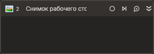

# Снимок рабочего стола



Компонент, создающий снимок рабочего стола. В случае, если нужно сделать снимок какого-либо запущенного процесса, указывается процесс. Если нужен снимок всего рабочего стола, свойства, относящиеся к процессу, не заполняются.

## Свойства
| Свойство     | Тип                        | Описание                                              |
| ------------ | -------------------------- | ----------------------------------------------------- |
| Переменная   | System.Drawing.Bitmap      | Переменная для сохранения изображения                 |

## Только код  
Пример использования элемента в процессе с типом **Только код** (Pure code):



```csharp
//Весь рабочий стол
SixLabors.ImageSharp.Image bmp = LTools.Desktop.DesktopApp.CreateScreenshot(wf);
bmp.SaveAsPng("screen.png");
```



```python
#Весь рабочий стол
bmp = LTools.Desktop.DesktopApp.CreateScreenshot(wf);
bmp.SaveAsPng("screen.png");
```



```javascript
//Весь рабочий стол
var bmp = _lib.LTools.Desktop.DesktopApp.CreateScreenshot(wf);
bmp.SaveAsPng("screen.png");
```


