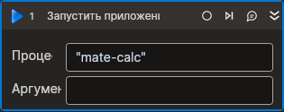

# Запустить приложение



Компонент, запускающий новый процесс.

## Свойства
| Свойство          | Тип                               | Описание                                                                            |
| ----------------- | --------------------------------- | ----------------------------------------------------------------------------------- |
| Тип автоматизации | LTools.Desktop.Model.DesktopTypes | Тип используемой при взаимодействии с приложением автоматизации (UIAUTOMATION, RDP) |
| Приложение\*      | String                            | Имя запускаемого приложения                                                         |
| Аргументы         | String                            | Аргументы процесса. Возможно указать несколько аргументов через пробел: `"arg1 arg2"` |
| Рабочая папка     | String                            | Путь к рабочей папке процесса                                                       |
| Ожидать запуск    | Boolean                           | Ожидать запуск приложения                                                           |
| Переменная\*      | System.Diagnostics.Process        | Переменная для хранения созданного процесса                                         |

## Только код  
Пример использования элемента в процессе с типом **Только код** (Pure code):
> Для работы с примером необходимо установить приложение **mate-calc**.



```csharp
LTools.Desktop.DesktopApp.Start(wf, "mate-calc", null, null, LTools.Desktop.Model.DesktopTypes.UIAUTOMATION, true);
LTools.Desktop.DesktopApp.Start(wf, "mate-calc", "--version");
```



```python
LTools.Desktop.DesktopApp.Start(wf, "mate-calc", None, None, LTools.Desktop.Model.DesktopTypes.UIAUTOMATION, True)
LTools.Desktop.DesktopApp.Start(wf, "mate-calc", "--version")
```



```javascript
_lib.LTools.Desktop.DesktopApp.Start(wf, "mate-calc", null, null, _lib.LTools.Desktop.Model.DesktopTypes.UIAUTOMATION, true);
_lib.LTools.Desktop.DesktopApp.Start(wf, "mate-calc", "--version");
```


