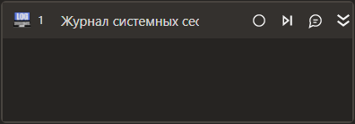

# Журнал системных сессий

Элемент, позволяющий читать лог(и) сессий операционной системы.

Позволяет компенсировать и дополнить регистрацию системных событий в случаях, когда их невозможно отследить/перехватить в режиме реального времени.

## Свойства
| Свойства                  | Тип                                                       | Описание                                                  |
| ------------------------- | --------------------------------------------------------- | --------------------------------------------------------- |
| С даты/времени            | System.Nullable\<System.DateTime>                         | Минимальная начальная дата/время сессии                   |
| По дату/время             | System.Nullable\<System.DateTime>                         | Максимальная конечная дата/время сессии                   |
| Максимальное число сессий | System.Nullable\<System.Int32>                            | Максимальное допустимое число сессий в итоговом множестве |
| Переменная | System.Collections.Generic.List\<LTools.Desktop.Model.SystemSessionInfo> | Переменная для сохранения списка сессий                   |

При этом тип `LTools.Desktop.Model.SystemSessionInfo` имеет следующие свойства:

| Свойства               | Описание                                                  |
| ---------------------- | --------------------------------------------------------- |
| UserOrPseudoUser       | Логин пользователя или имя процесса (псевдо-пользователя) |
| InteractionDescription | Описание способа взаимодействия с системой                |
| StartedAt              | Дата/время начала сессии                                  |
| EndedAt                | Дата/время окончания сессии                               |
| Duration               | Длительность сессии                                       |
| SystemSessionState     | Состояние сессии                                          |
