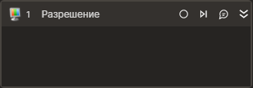

# Разрешение



Элемент, осуществляющий смену разрешения экрана.

| Свойство     | Тип            | Описание                                           |
|--------------|----------------| -------------------------------------------------- |
| ***Процесс*** |                |                        |
| Вертикальное | int?           | Вертикальное разрешение |
| Горизонтальное | int?               | Горизонтальное разрешение |
| Таймаут\*    | Int32          | Предельное время ожидания завершения процесса (мс) |
| ***Вывод***  |                |                        |
| Разрешение   | Avalonia.Point | Текущее разрешение экрана|




```csharp
LTools.Desktop.DesktopApp.ChangeResolution(wf, 1920, 1080, 20000);
```



```python
LTools.Desktop.DesktopApp.ChangeResolution(wf, 1920, 1080, 20000)
```



```javascript
_lib.LTools.Desktop.DesktopApp.ChangeResolution(wf, 1920, 1080, 20000);
```


