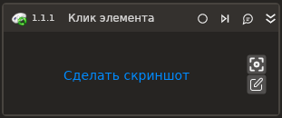

# Клик элемента

Для работы активности с типом регистратора событий уровня файла HID необходимо установить утилиту "Evtest" и дать права на чтения всех файлов по пути "/dev/input".

Компонент, ожидающий событие нажатия мыши в окне приложения.

| Свойство              | Тип                                | Описание                              |
| --------------------- | ---------------------------------- | ------------------------------------- |
| Шаблон поиска         | String                             | Шаблон поиска элемента управления     |
| Заголовок             | String                             | Заголовок подключаемого приложения    |
| Имя процесса          | String                             | Имя процесса                          |
| Основная кнопка       | LTools.Common.Model. MouseButtons  | Основная кнопка                       |
| Модификатор           | Avalonia.Input.KeyModifiers | Кнопка-модификатор (Ctrl, Shift...)   |
| Дополнительная кнопка | Avalonia.Input.KeyModifiers | Дополнительная кнопка                 |
| Дочерние              | Boolean                            | Включая события от дочерних элементов |
| Область           | System.Drawing.Rectangle                            | Область клика мышью                   |
| Тип регистратора событий | LTools.Common.Model.SystemEventsObservers.InputDeviceEventsObservers.Base.InputDeviceEventsObserverTypes | Тип регистратора событий в системе
