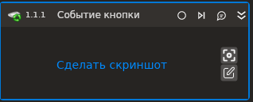

# Событие кнопки приложения

Компонент, ожидающий событие нажатия кнопки приложения.

Для работы активности с типом [регистратора событий](/g_elements/el-linux/el-linux-basic/els-browser/els-events/event-recorder) уровня файла HID необходимо установить утилиту `Evtest` и дать права на чтения всех файлов по пути `/dev/input`.

### Свойства
Описание общих свойств элемента см. в разделе [Свойства элемента](https://docs.primo-rpa.ru/primo-rpa/primo-studio/process/elements#svoistva-elementa).\
Символ `*` в названии свойства указывает на обязательность заполнения.

1. **Шаблон поиска** *[String]* - Шаблон поиска элемента управления
1. **Заголовок** *[String]* - Заголовок подключаемого приложения
1. **Имя процесса** *[String]* - Имя процесса
1. **Основная кнопка\*** *[LTools.Common. Model.VirtualKey]* - Основная кнопка
1. **Модификатор** *[LTools.Common. Model.VirtualKey]* - Кнопка-модификатор (Ctrl, Shift...)
1. **Дополнительная кнопка** *[LTools.Common. Model.VirtualKey]* - Дополнительная кнопка
1. **Состояние** *[LTools.Common.Model. Triggers.KeyTriggerState]* - Состояние кнопки (состояние отжатой кнопки работает только с типом регистратора событий уровня файла HID)
1. **Тип регистратора событий** *[LTools.Common.Model.SystemEventsObservers.InputDeviceEventsObservers.Base.InputDeviceEventsObserverTypes]* - Тип [регистратора событий](/g_elements/el-linux/el-linux-basic/els-browser/els-events/event-recorder) в системе
