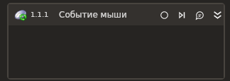

# Событие мыши

Компонент, ожидающий событие нажатия мыши. Обратите внимание, что элемент помещается в контейнер **События**. В этом же контейнере настраивается режим работы цикла и работа с потоками.

Для работы активности с типом [регистратора событий](/g_elements/el-linux/el-linux-basic/els-browser/els-events/event-recorder) уровня файла HID необходимо установить утилиту `Evtest` и дать права на чтения всех файлов по пути `/dev/input`.

### Свойства
Описание общих свойств элемента см. в разделе [Свойства элемента](https://docs.primo-rpa.ru/primo-rpa/primo-studio/process/elements#svoistva-elementa).\
Символ `*` в названии свойства указывает на обязательность заполнения.

1. **Основная кнопка** *[Common.Model. MouseButtons]* - Основная кнопка
1. **Модификатор** *[System.Windows.Input. ModifierKeys]* - Кнопка-модификатор (Ctrl, Shift...)
1. **Дополнительная кнопка** *[System.Windows.Input. ModifierKeys]* - Дополнительная кнопка
1. **Область** *[System.Drawing.Rectangle]* - Область клика мыши
1. **Тип регистратора событий** *[LTools.Common.Model.SystemEventsObservers.InputDeviceEventsObservers.Base.InputDeviceEventsObserverTypes]* - Тип [регистратора событий](/g_elements/el-linux/el-linux-basic/els-browser/els-events/event-recorder) в системе

### Обучающий пример

На портале Learning можно скачать процесс [Событие мыши.ltw](https://github.com/PrimoRPA/Learning/blob/master/StudioActivities/Ru/%D0%A0%D0%B0%D0%B1%D0%BE%D1%87%D0%B8%D0%B9%20%D1%81%D1%82%D0%BE%D0%BB/%D0%A1%D0%BE%D0%B1%D1%8B%D1%82%D0%B8%D1%8F/%D0%A1%D0%BE%D0%B1%D1%8B%D1%82%D0%B8%D0%B5%20%D0%BC%D1%8B%D1%88%D0%B8.ltw), демонстрирующий работу элемента. Добавьте этот процесс в свой проект в Студии, чтобы просмотреть его.
