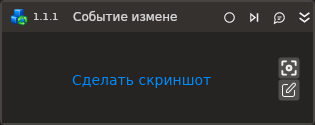

# Событие изменения аттрибута

Компонент, ожидающий событие изменения аттрибута элемента управления.

| Свойство        | Тип     | Описание                           |
| --------------- | ------- | ---------------------------------- |
| **Процесс**                                                    |
| Шаблон поиска\* | String  | Шаблон поиска элемента управления  |
| **Рабочий стол**                                               |
| Заголовок       | String  | Заголовок подключаемого приложения |
| Имя процесса    | String  | Имя процесса                       |
| **Атрибуты**                                                   |
| Выключен        | Boolean | Элемент выключен (недоступен для ввода, пример чек-бокса с выключенным состоянием  ) |
| Фокус           | Boolean | Фокус ввода на элементе            |
| Значение        | Boolean | Значение элемента                  |
