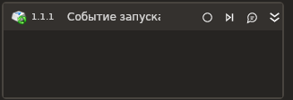

# Событие запуска процесса

Элемент, отслеживающий запуск процессов.

| Свойство       | Тип    | Описание                    |
| -------------- | ------ | --------------------------- |
| Имя процесса | String | Имя отслеживаемого процесса |
Имeна процессов | List\<String> | Имена отслеживаемых процессов |
