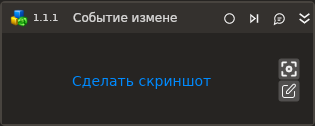

# Событие изменения состояния

Компонент, ожидающий событие изменения состояния элемента управления.

| Свойство        | Тип                                    | Описание                           |
| --------------- | -------------------------------------- | ---------------------------------- |
| Шаблон поиска\* | String                                 | Шаблон поиска элемента управления  |
| Заголовок       | String                                 | Заголовок подключаемого приложения |
| Имя процесса    | String                                 | Имя процесса                       |
| Видимость       | LTools.Desktop.Model.StateChangeTypes  | Изменение состояния видимости, задает условие срабатывания события: `OnAppear` - элемент появился, `OnDisappear` - элемент исчез          |
