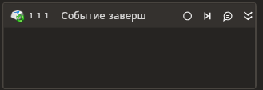

# Событие завершения процесса

Элемент, отслеживающий завершение процессов.

| Свойство       | Тип    | Описание                    |
| -------------- | ------ | --------------------------- |
| Имя процесса\* | String | Имя отслеживаемого процесса |
Имена процессов\* | List\<String> | Имена отслеживаемых процессов |
