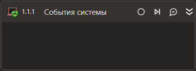

# События системы

Элемент, позвляющий отслеживать ключевые события операционной системы.

### Свойства
Описание общих свойств элемента см. в разделе [Свойства элемента](https://docs.primo-rpa.ru/primo-rpa/primo-studio/process/elements#svoistva-elementa).\
Символ `*` в названии свойства указывает на обязательность заполнения.

1. **Вход в спящий режим** - При выборе данной опции будут регистрироваться события перехода системы в режим сна
1. **Выход из спящего режима** - При выборе данной опции будут регистрироваться события выхода системы из режима сна
1. **Вход в систему** - При выборе данной опции будут регистрироваться события входа в систему
1. **Выход из системы** - При выборе данной опции будут регистрироваться события выхода из системы

### Замечание
Для работы данной активности под семейством ОС Linux **необходимы** следующие изменения в настройках системы:
1. В файле `/etc/systemd/logind.conf` прописать следующую настройку: `KillUserProcesses=no`.
