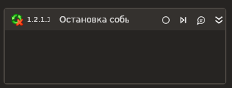

# Остановка событий

Элемент, останавливающий работу контейнера обработчиков событий.

### Свойства
Описание общих свойств элемента см. в разделе [Свойства элемента](https://docs.primo-rpa.ru/primo-rpa/primo-studio/process/elements#svoistva-elementa).\
Символ `*` в названии свойства указывает на обязательность заполнения.

1. **Переменная\*** *[LTools.Common.UIElements. IWFTriggerScope]* - Переменная-ссылка на контейнер
