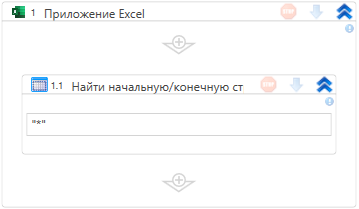
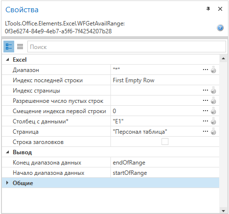

# Найти начальную/конечную строку

Элемент помогает определить границы данных в рамках указанного столбца. В ответе возвращаются номера первой и последней строк с данными. В свойствах элемента возможно настроить способы определения этих строк. 

Путь до файла, тип драйвера и другие базовые настройки указываются в контейнере [Приложение Excel](https://docs.primo-rpa.ru/primo-rpa/g_elements/el_basic/els_excel/el_excel_app).



## Свойства
Символ `*` в названии свойства указывает на обязательность заполнения. Описание общих свойств см. в разделе [Свойства элемента](https://docs.primo-rpa.ru/primo-rpa/primo-studio/process/elements#svoistva-elementa).

| Свойство                  | Тип     | Описание                                                                                                               | Пример         |                     
| ------------------------- | ------- | ---------------------------------------------------------------------------------------------------------------------- | -------------- |
| **Excel:**                | | | |
| Диапазон                  | String  | Диапазон считывания ячеек. Например, `"A1:D12"`. Если указан символ `"*"`, то будет прочитан весь лист. Если значение не указано, будет прочитан выделенный диапазон | `"*"` |
| Столбец с данными\*       | String  | Адрес столбца, в котором нужно найти данные                                                                            | `"А1"`         | 
| Страница                  | String  | Название страницы Excel                                                                                                | `"Лист1"`      |         
| Индекс страницы           | Int32   | Номер страницы Excel. Нумерация начинается с нуля. Если указано название страницы, номер можно пропустить              | `0`            |
| Строка заголовков         | Boolean | Определяет, содержит ли первая строка заголовки таблицы. По умолчанию чекбокс не установлен — считается, что первая строка не содержит заголовки |     |
| Смещение индекса первой строки | Int32 | Количество строк, которые следует прибавить к номеру первой строки. Например, когда в таблице есть скрытые строки   | `0`            |
| Индекс последней строки   | -       | Признак, по которыму вы хотите определять номер последней строки. <p> Возможные значения:</p> <p> 1. **First Empty Row** (по умолчанию) — если выбрано это значение, то последней строкой будет считаться первая пустая строка.</p> 2. **Last Populated Row** — вернет номер последней строки, содержащей данные | `First Empty Row` |
| Разрешенное число пустых строк | Int32 | Позволяет установить количество последовательных пустых строк, разрешенных в данных, прежде чем будет определено, что диапазон закончился. По умолчанию пустые строки в данных не разрешены | `2` |
| **Вывод:**                | | | |
| Начало диапазона данных   | Int32   | Название переменной, в которую запишется начало диапазона данных. Фактически — номер первой строки с данными    |  |                                             
| Конец диапазона данных    | Int32   | Название переменной, в которую запишется конец диапазона данных                                                                |  |

На рисунке ниже приведен пример заполненных свойств. Исходя из свойств, элемент будет искать начальную и конечную строки в таблице на листе «Персонал таблица». Последняя строка диапазона определяется первой пустой строкой. Ячейка столбца, с которой будет считаться количество строк с данными, определена как "Е1".



## Пример использования 
RPA-проект, демонстрирующий работу элемента, можно найти в нашем публичном репозитории [Learning](https://github.com/PrimoRPA/Learning).

1. Скачайте архив со всеми обучающими материалами по ссылке: [Скачать архив Learning](https://github.com/PrimoRPA/Learning/archive/refs/heads/master.zip).
2. Распакуйте архив и откройте в Студии проект **WorkWithExcelExample**.
3. Элемент **Найти начальную/конечную строку** находится в процессе `Main.ltw`. Описание процесса можно найти в файлах проекта. 


## Только код

Пример использования элемента в процессе с типом **Только код** (Pure code):



```csharp
LTools.Office.ExcelApp app = LTools.Office.ExcelApp.Init(wf, @"c:\file.xlsx");
Tuple<int, int> data = app.FindFirstAndLastDataRow("A1:C22", null, 0, "A1");
```



```python
app = LTools.Office.ExcelApp.Init(wf, @"c:\file.xlsx")
data = app.FindFirstAndLastDataRow("A1:C22", None, 0, "A1")
```



```javascript
var app = _lib.LTools.Office.ExcelApp.Init(wf, @"c:\file.xlsx");
var data = app.FindFirstAndLastDataRow("A1:C22", null, 0, "A1");
```


