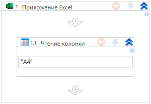
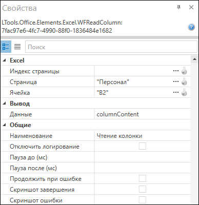

# Чтение колонки

Элемент считывает данные из указанного столбца. Полученный результат сохраняется в переменную.

Путь до файла, тип драйвера и другие базовые настройки указываются в контейнере [Приложение Excel](https://docs.primo-rpa.ru/primo-rpa/g_elements/el_basic/els_excel/el_excel_app).




## Свойства
Символ `*` в названии свойства указывает на обязательность его заполнения. Описание общих свойств см. в разделе [Свойства элемента](https://docs.primo-rpa.ru/primo-rpa/primo-studio/process/elements#svoistva-elementa).

| Свойство             | Тип                   | Описание                         | Пример       |
| -------------------- | --------------------- | -------------------------------- | ------------ |
| **Excel:**  | | |
| Ячейка\*             | String   | Идентификатор начальной ячейки                | `"A4"`       |
| Страница             | String   | Название страницы, где находится столбец      | `"Лист1"`    |
| Индекс страницы      | Int32    | Порядковый номер страницы, отсчет с 0         | `0`          |
| **Вывод:**  | | |
| Данные\*             | List\<Object\> | Название переменной для записи данных из колонки |     |

**Пример заполненных свойств**:



## Пример использования
RPA-проект, демонстрирующий работу элемента, можно найти в нашем публичном репозитории [Learning](https://github.com/PrimoRPA/Learning).

1. Скачайте архив со всеми обучающими материалами по ссылке: [Скачать архив Learning](https://github.com/PrimoRPA/Learning/archive/refs/heads/master.zip).
2. Распакуйте архив и откройте в Студии проект **WorkWithExcelExamples**. Проект состоит из процессов-последовательностей.


## Только код
Ниже приведен пример использования элемента в процессе с типом **Только код** (Pure code):



```csharp
//Свойства элемента:
//app - [LTools.Office.ExcelApp] Приложение Excel
//cell- Ячейка: [String] Идентификатор ячейки (A1), с которой начинается чтение
//data - Данные: [List<Object>] Данные в формате списка объектов
//sheet - Страница: [String] Наименование страницы
//sheetIdx - Индекс страницы: [Int32] Индекс страницы
		
LTools.Office.ExcelApp app = LTools.Office.ExcelApp.Init(wf, ".\\TestData.xlsx", ";", LTools.Office.Model.InteropTypes.DX);
String cell="A2";
List<Object> data = app.ReadColumn(cell,"Лист1",0);
		
foreach (object value in data)
{
    LTools.Workflow.PrimoApp.AddToLog(wf, value.ToString(), LTools.Enums.LogMessageType.Info);
}
```



```python
#Свойства элемента:
#app - [LTools.Office.ExcelApp] Приложение Excel
#cell - Ячейка: [String] Идентификатор начальной ячейки (A4)
#data - Данные: [List<Object>] Данные, полученные из колонки
#sheet - Страница: [String] Наименование страницы
#sheetIdx - Индекс страницы: [Int32] Индекс страницы
		
app = LTools.Office.ExcelApp.Init(wf, ".\\TestData.xlsx", ";", LTools.Office.Model.InteropTypes.DX)
cell = "A2"
data = app.ReadColumn(cell, "Лист1", 0) #List<Object>
       
#Вывод в лог
for value in data:
    LTools.Workflow.PrimoApp.AddToLog(wf, str(value), LTools.Enums.LogMessageType.Info)
```



```javascript
//Свойства элемента:
//app - [LTools.Office.ExcelApp] Приложение Excel
//cell - Ячейка: [String] Идентификатор начальной ячейки (A4)
//data - Данные: [List<Object>] Данные, полученные из колонки
//sheet - Страница: [String] Наименование страницы
//sheetIdx - Индекс страницы: [Int32] Индекс страницы

let app = _lib.LTools.Office.ExcelApp.Init(wf, ".\\TestData.xlsx", ";", _lib.LTools.Office.Model.InteropTypes.DX);
var cell = "A2";
var data = app.ReadColumn(cell, "Лист1", 0); //List<Object>
		
//Вывод в лог	
_lib.LTools.Workflow.PrimoApp.AddToLog(wf, data[0].toString(), _lib.LTools.Enums.LogMessageType.Info);
		
//Вывод в лог	
for(var index = 0; index < data.length; ++index){
    _lib.LTools.Workflow.PrimoApp.AddToLog(wf, data[index].toString(), _lib.LTools.Enums.LogMessageType.Info);
```


