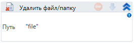

# Удалить файл/папку




Компонент, удаляющий файл.

| Свойство | Тип    | Описание                                     |
| -------- | ------ | -------------------------------------------- |
| Путь\*   | String | Путь к удаляемому файлу (c:\folder\file.txt) |



```csharp
System.IO.File.Delete(@"C:\text.txt");
System.IO.Directory.Delete(@"C:\Dir");
```



```python
System.IO.File.Delete("C:\\text.txt")
System.IO.Directory.Delete("C:\\Dir")
```



```javascript
_lib.System.IO.File.Delete("C:\\text.txt");
_lib.System.IO.Directory.Delete("C:\\Dir");
```


