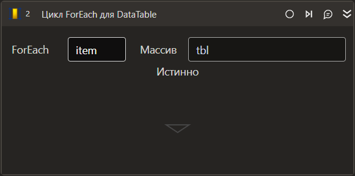

# Цикл ForEach для DataTable

*Eng: ForEach Row in DataTable*

Компонент-цикл, перебирающий все значения выбранного массива.

## Свойства
Описание общих свойств элемента см. в разделе [Свойства элемента](https://docs.primo-rpa.ru/primo-rpa/primo-studio/process/elements#svoistva-elementa).\
Символ `*` в названии свойства указывает на обязательность заполнения.

**Последовательность**

1. **Имя объекта в Оркестраторе** *[String]* - Имя объекта в Оркестраторе

**Процесс**

1. **Массив\*** *[System.Data.[DataTable](https://learn.microsoft.com/ru-ru/dotnet/api/system.data.datatable?view=net-5.0)]* - Массив, значения которого перебираются в цикле
1. **Виртуальная переменная\*** - Переменная, хранящая значение текущей переменной массива
1. **Переменная\*** *[System.Data.[DataRow](https://learn.microsoft.com/ru-ru/dotnet/api/system.data.datarow?view=net-7.0)]* - Переменная, хранящая значение текущей переменной массива. В отличие от виртуальной, будет доступна в проекте даже после завершения работы цикла
1. **Индекс** *[Int32]* - Индекс текущей итерации
1. **Кешировать** *[Boolean]* - Определяет, нужно ли кешировать коллекцию. По умолчанию кеширование включено - список для итерации будет рассчитан только при первом проходе цикла. При выключении параметра - коллекция будет пересчитываться при каждой итерации
1. **Повторов в минуту** *[Int32]* - Повторов в минуту
