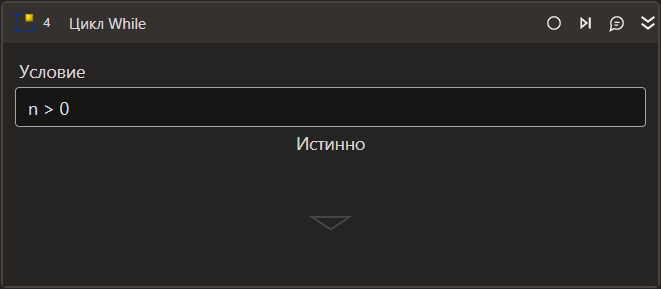

# Цикл While

Цикл, продолжающийся, пока установленное в нем выражение возвращает Истину (в начале цикла).

| Свойство    | Тип     | Описание                                                                |
| ----------- | ------- | ----------------------------------------------------------------------- |
| ***Последовательность*** |          |                                                  |
| Имя объекта в оркестраторе | String | Имя объекта в оркестраторе |
| ***Процесс*** |    
| Условие\* | Boolean | Выражение, истинность которого проверяется перед каждой итерацией цикла |
| Повторов в минуту | Int32 | Повторов в минуту. |
