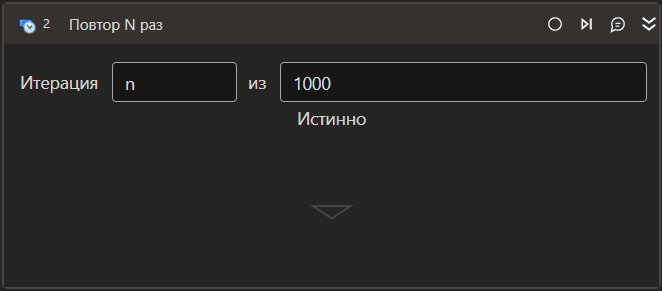

# Повтор N раз

Компонент-цикл, выполняющийся заданное число раз.

| Свойство     | Тип   | Описание                                    |
| ------------ | ----- | ------------------------------------------- |
| ***Последовательность*** |          |                                                  |
| Имя объекта в оркестраторе | String | Имя объекта в оркестраторе |
| ***Процесс*** |          |                                                  |
| Число\*      | Int32 | Число повторений цикла                      |
| Переменная\* | Int32 | Переменная, хранящая номер текущей итерации |
| Повторов в минуту | Int32 | Повторов в минуту. |
