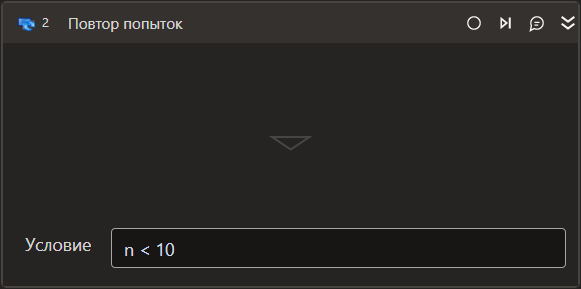
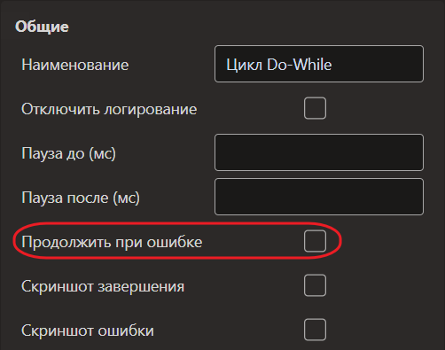

# Повтор попыток

*Eng: Retry*

Элемент представляет собой цикл, который повторяет попытки выполнения действия либо заданное число раз, либо до тех пор, пока не выполнится определенное условие. Это важное средство в автоматизации, обеспечивающее надежное и управляемое выполнение действий даже при возникновении ошибок или непредвиденных ситуаций.

Является контейнером для других элементов (собственно, действий).

## Свойства

Символ `*` в названии свойства указывает на обязательность заполнения. 
Описание общих свойств см. в разделе [Свойства элемента](https://docs.primo-rpa.ru/primo-rpa/primo-studio/process/elements#svoistva-elementa).

**Последовательность**

1. **Имя объекта в оркестраторе** *[String]* - Имя объекта в оркестраторе

**Процесс**

1. **Условие\*** *[Boolean]* - Условие выхода из цикла. Если условие истинно, то элемент **Повтор попыток** завершит выполнение. Пример: `var < 0`
1. **Число** *[Int32]* - Количество попыток выполнения действия (-ий), помещенного в контейнер. Если число задано и оно не равно нулю, то действие будет выполняться указанное количество раз. Пример: `10`
1. **Интервал** *[Int32]* - Интервал между попытками выполнения задачи, указывается в миллисекундах. Может быть полезен для снижения нагрузки на систему или учета времени ожидания. По умолчанию значение не задано
1. **Повторов в минуту** *[Int32]* - Повторов в минуту.

## Поведение при ошибке

***Если версия Студии 23.11 и выше***.

Установка галочки в общем свойстве **Продолжить при ошибке** позволяет элементу **Повтор попыток** выполнять действия даже в том случае, когда возникло исключение внутри контейнера. При обнаружении исключения начнется новая итерация цикла, а элементы, идущие после компонента с ошибкой, выполнены не будут.

Также, если свойство **Продолжить при ошибке** активно, то для элемента не будет учитываться такая [настройка](https://docs.primo-rpa.ru/primo-rpa/primo-studio/settings#otladchik) Студии, как остановка отладки на исключении.

***Если версия Студии ниже 23.11***.

Возникновение исключения в контейнере приводит к выходу из цикла, вне зависимости от состояния свойства **Продолжить при ошибке**.

##  Learning

Для обучения работе с элементом **Повтор попыток**:

1. Скачайте демонстрационный RPA-проект по ссылке: [Скачать архив Learning](https://github.com/PrimoRPA/Learning/archive/refs/heads/master.zip).
2. Распакуйте архив и откройте проект `StudioActivities` в Студии.
3. Найдите процесс `StudioActivities/Ru/Управление/Циклы.ltw` для изучения работы элемента.
