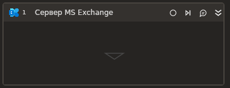

# Сервер MS Exchange



Элемент производит подключение к серверу Microsoft Exchange и позволяет роботу взаимодействовать с ним для выполнения операций с электронной почтой.

Является контейнером для других элементов, входящих в группу `MS Exchange`, которые используются для отправки/удаления писем, прикрепления файлов к письмам, извлечения вложений и других операций с электронной почтой.

## Свойства
Символ `*` в названии свойства указывает на обязательность заполнения. Описание общих свойств см. в разделе [Свойства элемента](https://docs.primo-rpa.ru/primo-rpa/primo-studio/process/elements#svoistva-elementa).

1. **Версия** *[Microsoft.Exchange.WebServices. Data.ExchangeVersion]* - версия сервера MS Exchange. По умолчанию установлена `Exchange2013_SP1`. Чтобы выбрать другую версию, щелкните выпадающий список значений.
2. **URL сервера** *[String]* - URL сервера MS Exchange. Пример: `"https://<server>/EWS/Exchange.asmx"`.
3. **E-mail** *[String]* - email пользователя. Укажите его, чтобы использовать [автообнаружение](https://learn.microsoft.com/ru-ru/exchange/architecture/client-access/autodiscover?view=exchserver-2019&viewFallbackFrom=exchserver-2013) URL для эндпойта веб-служб Exchange (EWS). Пример: `"user1@contoso.com"`.
4. **Домен** *[String]* - имя домена. Пример: `"contoso.com"`.
5. **Логин** *[String]* - логин пользователя.
6. **Пароль** *[String]* - пароль учетной записи Exchange.
7. **Защищенный пароль** *[[SecureString](https://learn.microsoft.com/ru-ru/dotnet/api/system.security.securestring?view=net-8.0&viewFallbackFrom=netcore-4.6.1)]* - поле для вставки зашифрованного пароля. В целях безопасности пароль в формате SecureString не хранится в открытом виде. Получить его можно, например, из программы **Диспетчер учетных данных** (Credential Manager).
8. **Российский часовой пояс** *[Boolean]* - настройка предназначена для корректировки времени. Например, в случае, если в русской локализации приложения наблюдается ошибка определения часового пояса. По умолчанию отключено.

:small_orange_diamond: **Внимание!** Для успешного извлечения вложений из писем необходимо активировать свойство **Российский часовой пояс**.

## Только код
Пример использования элемента в процессе с типом **Только код** (Pure code):



```csharp
var version = Microsoft.Exchange.WebServices.Data.ExchangeVersion.Exchange2010;
var url = "url";
var login = "login";
var password = "password";
var domain = "domain";
var russianTimeZone = false;

LTools.Office.MSExchangeApp app = LTools.Office.MSExchangeApp.InitSvc(wf, version, url, login, password, domain, russianTimeZone);

LTools.Office.MSExchangeApp app2 = LTools.Office.MSExchangeApp.InitAd(wf, version, url, login, password, domain, russianTimeZone);
```



```python
version = Microsoft.Exchange.WebServices.Data.ExchangeVersion.Exchange2010;
url = "url";
login = "login";
password = "password";
domain = "domain";
russianTimeZone = False;

app = LTools.Office.MSExchangeApp.InitSvc(wf, version, url, login, password, domain, russianTimeZone);

app2 = LTools.Office.MSExchangeApp.InitAd(wf, version, url, login, password, domain, russianTimeZone);
```



```javascript
var version = Microsoft.Exchange.WebServices.Data.ExchangeVersion.Exchange2010;
var url = "url";
var login = "login";
var password = "password";
var domain = "domain";
var russianTimeZone = false;

var app = _lib.LTools.Office.MSExchangeApp.InitSvc(wf, version, url, login, password, domain, russianTimeZone);

var app = _lib.LTools.Office.MSExchangeApp.InitAd(wf, version, url, login, password, domain, russianTimeZone);
```


