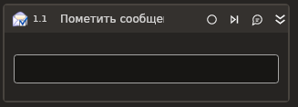

# Пометить сообщение



Компонент, делающий пометки на сообщениях электронной почты в MS Exchange.

| Свойство    | Тип                                                                    | Описание                 |
| ----------- | ---------------------------------------------------------------------- | ------------------------ |
| Тип метки   | LTools.Office.Model.OMailMarkTypes                                     | Тип метки сообщения      |
| Сообщения\* | List<[LTools.Office.Model.OMailMessage](../datatypes/omailmessage.md)> | Список писем для пометки |



```csharp
var version = Microsoft.Exchange.WebServices.Data.ExchangeVersion.Exchange2010;
var url = "url";
var login = "login";
var password = "password";
var domain = "domain";
var russianTimeZone = false;

LTools.Office.MSExchangeApp app = LTools.Office.MSExchangeApp.InitSvc(wf, version, url, login, password, domain, russianTimeZone);

List<LTools.Office.Model.OMailMessage> messages = null;
var markType = LTools.Office.Model.OMailMarkTypes.READ;

app.MarkMail(messages, markType);
```



```python
version = Microsoft.Exchange.WebServices.Data.ExchangeVersion.Exchange2010;
url = "url";
login = "login";
password = "password";
domain = "domain";
russianTimeZone = False;

app = LTools.Office.MSExchangeApp.InitSvc(wf, version, url, login, password, domain, russianTimeZone);

messages = None;
markType = LTools.Office.Model.OMailMarkTypes.READ;

app.MarkMail(messages, markType);
```



```javascript
var version = Microsoft.Exchange.WebServices.Data.ExchangeVersion.Exchange2010;
var url = "url";
var login = "login";
var password = "password";
var domain = "domain";
var russianTimeZone = false;

var app = _lib.LTools.Office.MSExchangeApp.InitSvc(wf, version, url, login, password, domain, russianTimeZone);

var messages = Null;
var markType = _lib.LTools.Office.Model.OMailMarkTypes.READ;

app.MarkMail(messages, markType);
```


