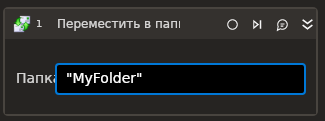

# Переместить в папку (IMAP)

*Eng: Move to folder (IMAP)*



Элемент перемещает сообщения между папками по протоколу IMAP.

## Свойства
Символ `*` в названии свойства указывает на обязательность заполнения. Описание общих свойств см. в разделе [Свойства элемента](https://docs.primo-rpa.ru/primo-rpa/primo-studio/process/elements#svoistva-elementa).

| Свойство                | Тип                                 | Описание                                                                                    |
| ----------------------- | ----------------------------------- | ------------------------------------------------------------------------------------------- |     
| _**Сервер:**_           |                                     |                            |
| Сервер\*                | String                              | Адрес почтового сервера    |
| Порт\*                  | Int32                               | Порт почтового сервера. По умолчанию `993` |
| Логин\*                 | String                              | Логин почтового сервера    |
| Пароль                  | String                              | Пароль почтового сервера   |
| Защищенный пароль       | SecureString                        | Если пароль используется в зашифрованном виде, укажите его в этом поле. Пароль в формате SecureString не хранится в открытом виде. Получить его можно, например, из диспетчера учетных данных Windows (Credential Manager)  |
| Использовать SSO        | Boolean                             | Определяет, нужно ли использовать Secure Socket Options (SSO) - набор параметров и настроек для безопасной передачи данных через защищенное сокет-соединение. По умолчанию параметр отключен. Настройка добавлена в версии 23.11  |                                                        
| SSO                     | -                                   | Способ указания шифрования, которое должно использоваться для сокет-соединения. Значение учитывается, только если включен параметр «Использовать SSO». В этом случае при подключении к почтовому серверу будет использовано SSO и проигнорировано свойство SSL |
| SSL\*                   | Boolean                             | Признак использования сервером соединения SSL  |
| Игнорировать сертификат | Boolean                             | Установка флага отключает проверку SSL-сертификата сервера. По умолчанию сертификат сервера проверяется. **Отключение проверки SSL-сертификата может привести к проблемам информационной безопасности (!)**, поэтому параметр следует использовать только в исключительных случаях, когда невозможно без него обойтись |
| Папка источник\*        | String                              | Папка входящих сообщений. По умолчанию `"Inbox"`  |
| Папка назначения\*      | String                              | Папка входящих сообщений   |
| Идентификаторы          | List\<String>                       | Массив идентификаторов получаемых сообщений |
| Письма                  | List <[LTools.Network.Model.EMail.MailMessage](datatypes/mailmessage.md)> | Массив сообщений  |
| Таймаут\*               | Int32                               | Предельное время ожидания завершения процесса, указывается в миллисекундах. По умолчанию `10000` |


## Только код

Пример использования элемента в процессе с типом **Только код** (Pure code):



```csharp
var server = "server";
var port = 443;
var login = "login";
var password = "password";
var inbox = "inbox";
var outbox = "outbox";
List<LTools.Network.Model.EMail.MailMessage> messages = null;
List<string> messageIds = null;
var isSsl = false;
var timeout = 10000;

LTools.Network.MailApp.IMAPMoveToFolder(wf, server, port, login, password, inbox, outbox, messages, isSsl, timeout);

LTools.Network.MailApp.IMAPMoveToFolder(wf, server, port, login, password, inbox, outbox, messageIds, isSsl, timeout);
```



```python
server = "server";
port = 443;
login = "login";
password = "password";
inbox = "inbox";
outbox = "outbox";
messages = None;
messageIds = None;
isSsl = False;
timeout = 10000;

LTools.Network.MailApp.IMAPMoveToFolder(wf, server, port, login, password, inbox, outbox, messages, isSsl, timeout);

LTools.Network.MailApp.IMAPMoveToFolder(wf, server, port, login, password, inbox, outbox, messageIds, isSsl, timeout);
```



```javascript
var server = "server";
var port = 443;
var login = "login";
var password = "password";
var inbox = "inbox";
var outbox = "outbox";
var messages = Null;
var messageIds = Null;
var isSsl = false;
var timeout = 10000;

_lib.LTools.Network.MailApp.IMAPMoveToFolder(wf, server, port, login, password, inbox, outbox, messages, isSsl, timeout);

_lib.LTools.Network.MailApp.IMAPMoveToFolder(wf, server, port, login, password, inbox, outbox, messageIds, isSsl, timeout);
```


