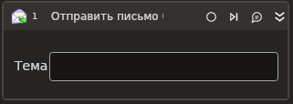

# Отправить письмо (SMTP)



Компонент, осуществляющий отправку почтового сообщения по протоколу SMTP.

| Свойство     | Тип           | Описание                                           |
| ------------ | ------------- | -------------------------------------------------- |
| От\*         | String        | Адресат - От кого                                  |
| Кому\*       | String        | Адресат - Кому                                     |
| Тема         | String        | Тема сообщения                                     |
| Содержимое\* | String        | Содержимое сообщения                               |
| HTML         | Boolean       | Признак HTML-содержимого сообщения                 |
| Вложения     | List\<String> | Пути к файлам вложений                             |
| Сервер\*     | String        | Адрес почтового сервера                            |
| Порт\*       | Int32         | Порт почтового сервера                             |
| Логин\*      | String        | Логин почтового сервера                            |
| Пароль\*     | String        | Пароль почтового сервера                           |
| SSL\*        | Boolean       | Признак использования сервером соединения SSL      |
| Таймаут\*    | Int32         | Предельное время ожидания завершения процесса (мс) |



```csharp
var fromEmailAddress = "fromEmailAddress";
var toEmailAddress = "toEmailAddress";
var subject = "subject";
var body = "body";
var server = "server";
var port = 443;
var login = "login";
var password = "password";
var isHtml = false;
var isSsl = false;
List<string> attachments = null;
var timeout = 10000;
var ignoreCertificate = false;
var useSso = false;
var sso = MailKit.Security.SecureSocketOptions.Auto;

LTools.Network.MailApp.SMTPSend(wf, fromEmailAddress, toEmailAddress, subject, body, server, port, login, password, isHtml, isSsl, attachments, timeout, ignoreCertificate, useSso, sso);
```



```python
fromEmailAddress = "fromEmailAddress";
toEmailAddress = "toEmailAddress";
subject = "subject";
body = "body";
server = "server";
port = 443;
login = "login";
password = "password";
isHtml = false;
isSsl = false;
attachments = None;
timeout = 10000;
ignoreCertificate = false;
useSso = false;
sso = MailKit.Security.SecureSocketOptions.Auto;

LTools.Network.MailApp.SMTPSend(wf, fromEmailAddress, toEmailAddress, subject, body, server, port, login, password, isHtml, isSsl, attachments, timeout, ignoreCertificate, useSso, sso);
```



```javascript
var fromEmailAddress = "fromEmailAddress";
var toEmailAddress = "toEmailAddress";
var subject = "subject";
var body = "body";
var server = "server";
var port = 443;
var login = "login";
var password = "password";
var isHtml = false;
var isSsl = false;
var attachments = Null;
var timeout = 10000;
var ignoreCertificate = false;
var useSso = false;
var sso = MailKit.Security.SecureSocketOptions.Auto;

_lib.LTools.Network.MailApp.SMTPSend(wf, fromEmailAddress, toEmailAddress, subject, body, server, port, login, password, isHtml, isSsl, attachments, timeout, ignoreCertificate, useSso, sso);
```


