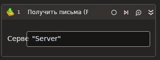

# Получить письма (POP3)



Компонент, осуществляющий получение почтовых сообщений по протоколу POP3.

| Свойство            | Тип                                                                       | Описание                                           |
| ------------------- | ------------------------------------------------------------------------- | -------------------------------------------------- |
| Сервер\*            | String                                                                    | Адрес почтового сервера                            |
| Порт\*              | Int32                                                                     | Порт почтового сервера                             |
| Логин\*             | String                                                                    | Логин почтового сервера                            |
| Пароль\*            | String                                                                    | Пароль почтового сервера                           |
| SSL\*               | Boolean                                                                   | Признак использования сервером соединения SSL      |
| Удалять\*           | Boolean                                                                   | Автоматически удалять полученные сообщения         |
| Кол-во\*            | Int32                                                                     | Количество считываемых сообщений                   |
| Получать вложения\* | Boolean                                                                   | Признак получения вложений                         |
| Индексы             | List\<String>                                                             | Массив индексов получаемых сообщений               |
| Письма              | List <[LTools.Network.Model.EMail.MailMessage](datatypes/mailmessage.md)> | Массив сообщений                                   |
| Таймаут\*           | Int32                                                                     | Предельное время ожидания завершения процесса (мс) |
| Результат\*         | List<[LTools.Network.Model.EMail.MailMessage](datatypes/mailmessage.md)>  | Массив полученных сообщений                        |



```csharp
var server = "server";
var port = 443;
var login = "login";
var password = "password";
var messageCount = 10;
List<LTools.Network.Model.EMail.MailMessage> messages = null;
List<string> messageIds = null;
var isDeleteAfterReceive = false;
var isReadingAttachment = false;
var isSsl = false;
var timeout = 10000;
var useSso = false;
MailKit.Security.SecureSocketOptions sso = MailKit.Security.SecureSocketOptions.Auto;
var ignoreCertificate = false;

List<LTools.Network.Model.EMail.MailMessage> mails = LTools.Network.MailApp.POP3Receive(wf, server, port, login, password, messageCount, messageIds, isDeleteAfterReceive, isReadingAttachment, isSsl, timeout, useSso, sso, ignoreCertificate);

List<LTools.Network.Model.EMail.MailMessage> mails2 = LTools.Network.MailApp.POP3Receive(wf, server, port, login, password, messageCount, messages, isDeleteAfterReceive, isReadingAttachment, isSsl, timeout, useSso, sso, ignoreCertificate);
```



```python
server = "server";
port = 443;
login = "login";
password = "password";
messageCount = 10;
messages = None;
messageIds = None;
isDeleteAfterReceive = False;
isReadingAttachment = False;
isSsl = False;
timeout = 10000;
useSso = False;
sso = MailKit.Security.SecureSocketOptions.Auto;
ignoreCertificate = False;

mails = LTools.Network.MailApp.POP3Receive(wf, server, port, login, password, messageCount, messageIds, isDeleteAfterReceive, isReadingAttachment, isSsl, timeout, useSso, sso, ignoreCertificate);

mails2 = LTools.Network.MailApp.POP3Receive(wf, server, port, login, password, messageCount, messages, isDeleteAfterReceive, isReadingAttachment, isSsl, timeout, useSso, sso, ignoreCertificate);
```



```javascript
var server = "server";
var port = 443;
var login = "login";
var password = "password";
var messageCount = 10;
List<LTools.Network.Model.EMail.MailMessage> messages = Null;
List<string> messageIds = Null;
var isDeleteAfterReceive = false;
var isReadingAttachment = false;
var isSsl = false;
var timeout = 10000;
var useSso = false;
MailKit.Security.SecureSocketOptions sso = MailKit.Security.SecureSocketOptions.Auto;
var ignoreCertificate = false;

var mails = _lib.LTools.Network.MailApp.POP3Receive(wf, server, port, login, password, messageCount, messageIds, isDeleteAfterReceive, isReadingAttachment, isSsl, timeout, useSso, sso, ignoreCertificate);

var mails2 = _libLTools.Network.MailApp.POP3Receive(wf, server, port, login, password, messageCount, messages, isDeleteAfterReceive, isReadingAttachment, isSsl, timeout, useSso, sso, ignoreCertificate);
```


