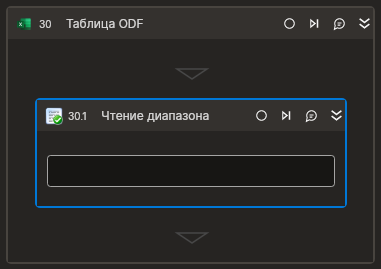

# Чтение диапазона

Компонент, считывающий данные из диапазона ячеек Excel.

## Свойства
Описание общих свойств элемента см. в разделе [Свойства элемента](https://docs.primo-rpa.ru/primo-rpa/primo-studio/process/elements#svoistva-elementa).\
Символ `*` в названии свойства указывает на обязательность заполнения.

1. **Диапазон** *[String]*: Диапазон считывания ячеек. Пример: `"A1:D12"`.Если не указывать значение, то будет прочитан выделенный диапазон. Если указать в качестве значения `*`, будет прочитан весь лист.
2. **Страница** *[String]*: Наименование страницы. Пример: `"List1"`.
3. **Индекс страницы** *[Int32]*: Индекс страницы - порядковый номер листа в книге Excel. Отсчет начинается с 0. Пример: `0`.
4. **Формат даты**: Явное указание формата даты.
5. **Строка заголовков** *[Boolean]*: Признак того, что первая строка содержит заголовки.
6. **Переменная (текст)** *[List\<List\<string>>]*: Переменная для хранения результатов чтения в виде текстовых значений.
7. **Переменная (информация)** *[List\<List \<[LTools.Office.Model.ExcelCellInfo](https://docs.primo-rpa.ru/primo-rpa/g_elements/osnovnye-elementy/prilozhenie-excel/datatypes/excelcellinfo)>>]*: Переменная для хранения результатов о чтении дополнительной информации о ячейках: например, о цвете шрифта.
8. **Переменная (таблица)** *[[System.Data.DataTable](https://learn.microsoft.com/ru-ru/dotnet/api/system.data.datatable?view=net-6.0)]*: Переменная для хранения результатов чтения в табличном виде.
9. **Учитывать типы полей ячеек Excel** *[Boolean]*: Нужно ли учитывать типы ячеек в таблице Excel.

## Только код
Пример использования элемента в процессе с типом Только код (Pure code):  

**C#**  
`Primo.Office.OdfOxml.ExcelApp app = Primo.Office.OdfOxml.ExcelApp.Init(wf, [file]);`  
`List<List<string>> data = app.ReadRange(range, [sheet], [sheetIdx]);`  
`List<List<LTools.Office.Model.ExcelCellInfo>> data = app.ReadRangeInfo(range, [sheet], [sheetIdx]);`  
`System.Data.DataTable data = app.ReadRangeTable(range, [sheet], [sheetIdx]);`
