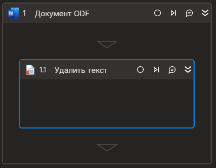

# Удалить текст



Элемент удаляет текст заданной длины. Элемент работает корректно только внутри контейнера "Документ ODF".

## Свойства
Символ `*` в названии свойства указывает на обязательность заполнения. Описание общих свойств см. в разделе [Свойства элемента](https://docs.primo-rpa.ru/primo-rpa/primo-studio/process/elements#svoistva-elementa).

| Свойство     | Тип    | Описание                                  | Пример          |
| ------------ | ------ | ----------------------------------------- | --------------- |
| **Word** | | | |
| Начало   | Int32 | Индекс символа начала текста (отсчет с нуля, по умолчанию ноль) | `15` |
| Длина   | Int32 |  Длина текста (по умолчанию до конца документа) | `14` |

## Только код
Пример использования элемента в процессе с типом **Только код** (Pure code):



```csharp
Primo.Office.OdfOxml.WordApp app = Primo.Office.OdfOxml.WordApp.Init(wf, "fileName");
app.DeleteText(10, 100);
```



```python
app = Primo.Office.OdfOxml.WordApp.Init(wf, "fileName")
app.DeleteText(10, 100)
```



```javascript
var app =  _lib.Primo.Office.OdfOxml.WordApp.Init(wf, "fileName");
app.DeleteText(10, 100);
```


