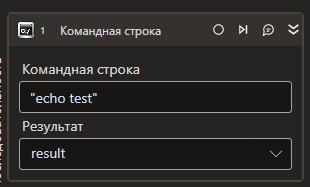

# Командная строка

Компонент, производящий выполнение консольной команды CMD.

| Свойство             | Тип     | Описание                                                  |
| -------------------- | ------- | --------------------------------------------------------- |
| Аргументы            | String  | Аргументы запускаемого процесса                           |
| Результат            | String  | Переменная для сохранения результатов выполнения процесса |
| Ожидать завершения\* | Boolean | Признак ожидания завершения процесса                      |
