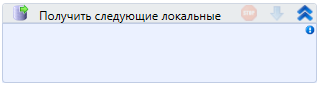

# Получить следующие локальные тестовые данные

Элемент, получающие следующие локальные тестовые данные

| Свойство     | Тип                         | Описание                       |
| ------------ | --------------------------- | ------------------------------ |
| Маппинг\*    | Boolean                     | Осуществить маппинг переменных |
| Переменная\* | Dictionary\<String, Object> | Переменная для хранения данных |


[testing.md](../../../primo-studio/process/debug/testing.md)

