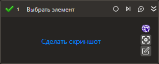

# Выбрать элемент

Изменяет состояние выбранного элемента управления. Используется для чекбоксов и радиокнопок.

## Свойства
Описание общих свойств элемента см. в разделе [Свойства элемента](https://docs.primo-rpa.ru/primo-rpa/primo-studio/process/elements#svoistva-elementa).\
Символ `*` в названии свойства указывает на обязательность заполнения.\
Символ ? в типе данных указывает на то, что значение может быть null.

| Свойство             | Тип                                  | Описание                                            |
| -------------------- | ------------------------------------ | --------------------------------------------------- |
| ***Процесс***        |                            |                         |
| Шаблон поиска        | String                               | Элемента управления                   |
| Элемент              | LTools.UIInteraction.Model.UIControl | Ссылка на элемент управления  |
| Новое состояние      | Boolean?                             | Новое состояние элемента                            |
| Таймаут\*            | Int32                                | Предельное время ожидания завершения процесса (мс)  |
| ***Вывод***          |                            |                    |
| Состояние            | Boolean?                             | Переменная вывода для сохранения текущего состояния элемента               |
