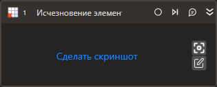

# Исчезновение элемента

Компонент, ожидающий исчезновение элемента управления.

## Свойства
Описание общих свойств элемента см. в разделе [Свойства элемента](https://docs.primo-rpa.ru/primo-rpa/primo-studio/process/elements#svoistva-elementa).\
Символ `*` в названии свойства указывает на обязательность заполнения.

| Свойство             | Тип                      | Описание                                            |
| -------------------- | ------------------------ | --------------------------------------------------- |
| Шаблон поиска\*      | String                   | Шаблон поиска элемента управления                   |
| Таймаут\*            | Int32                    | Предельное время ожидания завершения процесса (мс). По умолчанию `10000`  |
