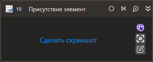

# Присутствие элемента

Компонент производит поиск элемента управления.

## Свойства
Описание общих свойств элемента см. в разделе [Свойства элемента](https://docs.primo-rpa.ru/primo-rpa/primo-studio/process/elements#svoistva-elementa).\
Символ `*` в названии свойства указывает на обязательность заполнения.

| Свойство             | Тип                                         | Описание                                              |
| -------------------- | ------------------------------------------- | ----------------------------------------------------- |
| ***Процесс***           |  |  |
| Шаблон поиска\*      | String                                      | Шаблон поиска элемента управления              |
| Видимость            | Boolean                                     | Определяет, нужно ли проверять видимость элемента |
| Таймаут\*            | Int32                                       | Предельное время ожидания завершения процесса (мс). По умолчанию `10000`    |
рекомендуется использовать его аккуратно |
| ***Вывод***           |  |  |
| Элемент              | [LTools.UIInteraction.Model.UIControl](https://docs.primo-rpa.ru/primo-rpa/g_elements/el_basic/els_uiinteraction/tipy-dannykh/uicontrol) | Переменная для хранения ссылки на элемент управления  |
| Элементы             | List\<LTools.UIInteraction.Model.UIControl> | Переменная для хранения ссылок на элементы управления |
| Результат            | Boolean                                     | Переменная, хранящая результаты поиска                |
