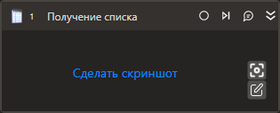

# Получение списка

Компонент, получающий значения из комбобокса (поле ввода со списком подсказок) либо списка.

## Свойства
Описание общих свойств элемента см. в разделе [Свойства элемента](https://docs.primo-rpa.ru/primo-rpa/primo-studio/process/elements#svoistva-elementa).\
Символ `*` в названии свойства указывает на обязательность заполнения.

| Свойство             | Тип                                  | Описание                                            |
| -------------------- | ------------------------------------ | --------------------------------------------------- |
| ***Процесс***          |  |  |
| Шаблон поиска        | String                               | Шаблон поиска элемента управления |
| Элемент              | LTools.UIInteraction.Model.UIControl | Ссылка на элемент управления  |
| Таймаут\*            | Int32                                | Предельное время ожидания завершения процесса (мс)  |
| ***Вывод***          |  |  |
| Значения             | List\<String>                        | Переменная для хранения всех полученных значений списка  |
| Выбранные            | List\<String>                        | Переменная для хранения только выбранных значений списка |
