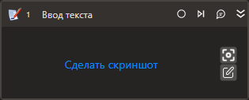

# Ввод текста

Компонент позволяет ввести текст в выбранный элемент управления. Инструмент .png>), который расположен на компоненте, позволяет автоматически заполнить [шаблон поиска](https://docs.primo-rpa.ru/primo-rpa/primo-studio/process/searchpatterns) нужного элемента управления.

Если элемент управления относится к определенному приложению, сначала используйте контейнер [**Присоединиться к приложению**](https://docs.primo-rpa.ru/primo-rpa/g_elements/osnovnye-elementy/els_desktop/el_desktop_attach), а уже в него поместите **Ввод текста**.

## Свойства
Описание общих свойств элемента см. в разделе [Свойства элемента](https://docs.primo-rpa.ru/primo-rpa/primo-studio/process/elements#svoistva-elementa).\
Символ `*` в названии свойства указывает на обязательность заполнения.

| Свойство             | Тип                                  | Описание                                            |
| -------------------- | ------------------------------------ | --------------------------------------------------- |
| ***Процесс:***        |                                      |                                                     |
| Текст                | String                               | Текст, который нужно ввести. Пример: `"text"`       |
| Защищенный текст     | SecureString | Для вставки зашифрованного текста. Например, пароля пользователя, который не должен храниться в открытом виде |
| Режим                | -                                    | Выберите режим ввода текста: INVOKE (по умолчанию) или SIMULATE. Режим INVOKE производит вставку текста, SIMULATE - эмулирует ввод текста с клавиатуры и предназначен для тех приложений, где ввод через INVOKE не поддерживается (например, в 1С) |
| Шаблон поиска        | String                               | Шаблон поиска элемента управления. Доступно заполнение вручную в формате JSON (через редактор) либо автоматически при помощи инструмента .png>) |
| Элемент              | LTools.UIInteraction.Model.UIControl | Переменная со ссылкой на элемент управления, который был найден и сохранен ранее. Если заполнено это свойство, шаблон поиска указывать не нужно |
| Таймаут\*            | Int32                                | Предельное время ожидания завершения процесса (мс)  |
| ***Эмуляция:***       |                                      |                                                     |
| Пауза                | Int32                                | Пауза между нажатиями в мс (**несовместимо с новым ядром**). Чем меньше пауза, тем быстрее будет введен текст |
| Очищать              | Boolean                              | Определяет, нужно ли очистить область ввода перед вставкой текста. По умолчанию выключено - не очищается |
| Фокус                | Boolean                              | Устанавливает фокус ввода в элементе управления. По умолчанию фокус включен |
