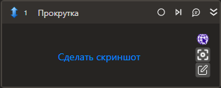

# Прокрутка

Осуществляет прокрутку в визуальном компоненте.

## Свойства
Описание общих свойств элемента см. в разделе [Свойства элемента](https://docs.primo-rpa.ru/primo-rpa/primo-studio/process/elements#svoistva-elementa).\
Символ `*` в названии свойства указывает на обязательность заполнения.\
Символ `?` в типе данных указывает на то, что значение может быть null.

| Свойство             | Тип                                  | Описание                                            |
| -------------------- | ------------------------------------ | --------------------------------------------------- |
| ***Процесс***  |  |  |
| Шаблон поиска        | String                               | Шаблон поиска элемента управления  |
| Элемент              | LTools.UIInteraction.Model.UIControl | Ссылка на элемент управления  |
| Таймаут\*            | Int32                                | Предельное время ожидания завершения процесса (мс)  |
| ***Прокрутка***  |  |  |
| Горизонтальная       | [double](https://learn.microsoft.com/ru-ru/dotnet/api/system.double?view=net-5.0&viewFallbackFrom=windowsdesktop-3.0) | Горизонтальная прокрутка (%; для браузера: пиксели)   |
| Вертикальная         | double                              | Вертикальная прокрутка (%; для браузера: пиксели)                          |
| ***Вывод***  |  |  |
| Прокрутка            | [System.Drawing.Point](https://learn.microsoft.com/ru-ru/dotnet/api/System.Drawing.Point?view=netcore-1.1)         | Переменная, которая сохранит текущее состояние прокрутки (%; для браузера: пиксели)  |

>Для браузерного типа приложения есть возможность прокрутить содержимое страницы целиком. Для этого нужно в шаблоне поиска выбрать корневой элемент `<body>`. Так как пикер не позволяет выбирать корневой элемент страницы непосредственно, есть способ как это сделать по-другому. Для этого нужно выбрать пикером любой элемент на странице. А затем в редакторе шаблона необходимо задать новое значение параметра Тэг – “body”. Остальные свойства `Текст`, `Css selector`, `Индекс` нужно очистить, а дополнительные свойства (атрибуты), если они есть, необходимо удалить.
