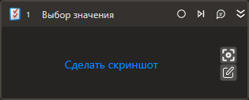

# Выбор значения

Компонент позволяет выбирать значения в комбобоксе либо списке.

## Свойства
Описание общих свойств элемента см. в разделе [Свойства элемента](https://docs.primo-rpa.ru/primo-rpa/primo-studio/process/elements#svoistva-elementa).\
Символ `*` в названии свойства указывает на обязательность заполнения.

| Свойство             | Тип                                  | Описание                                            |
| -------------------- | ------------------------------------ | --------------------------------------------------- |
| Шаблон поиска        | String                               | Шаблон поиска) элемента управления                  |
| Элемент              | [LTools.UIInteraction.Model.UIControl] Ссылка на элемент управления                        |
| Значение             | String                               | Выбираемое значение                                 |
| Значения             | List\<String>                        | Список выбираемых значений  (не поддерживается для десктопного приложения)                         |
| Индекс               | Int32                                | Индекс значения                                     |
| Индексы              | List\<Int32>                         | Индексы значений  (не поддерживается для десктопного приложения)                                    |
| Очистить             | Boolean                              | Определяет, нужно ли очистить список перед выбором (не поддерживается для десктопного приложения)|
| Таймаут\*            | Int32                                | Предельное время ожидания завершения процесса (мс). По умолчанию `10000`  |
