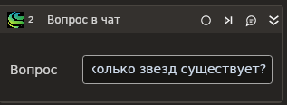

# Вопрос в чат

Элемент позволяет отправить вопрос в сервис GigaChat.

Элемент становится доступным после установки библиотеки **Primo.AI.Linux**.

В переменной вывода вернется ответ от нейросетевой модели.

## Предварительные условия

Для успешной отправки вопроса сначала следует [получить токен](https://docs.primo-rpa.ru/primo-rpa/g_elements/el_extra/ai/gigachat/el_gettoken). Токен действует в течение 30-ти минут, после чего его потребуется обновить.

## Свойства
Символ `*` в названии свойства указывает на обязательность заполнения. Описание общих свойств см. в разделе [Свойства элемента](https://docs.primo-rpa.ru/primo-rpa/primo-studio/process/elements#svoistva-elementa).

| Свойство           | Тип                                 | Описание                                                                                           |
| ------------------ | ----------------------------------- | -------------------------------------------------------------------------------------------------- |
| **GigaChat**       |                                     |                                                                                                    |
| Творчество             | Double                              | Творческая составляющая ответа. В значении укажите число от 0 до 1. Чем выше значение, тем более непредсказуемым будет результат выполнения запроса. По умолчанию `0.5`.                                            |
| Тайм-аут           | Int32                               | Максимальное время ожидания выполнения запроса. Указывается в миллисекундах, по умолчанию `20000`. |
| **Запрос**          |                                     |                                                                                                    |
| Токен*              | String                              |  Токен запроса. Указывается в виде переменной или константы. |
| Вопрос*              | String                              |  Текст вопроса. |
| Роль*               | String                              |  Имя роли в чате. По умолчанию "user". |
| **Вывод**          |                                     |                                                                                                    |
| Ответ              | String                              | Переменная для хранения ответа GigaChat. |
