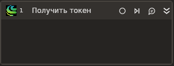

# Получить токен

Элемент позволяет получить токен для работы с сервисом GigaChat.

Элемент становится доступным после установки библиотеки **Primo.AI.Linux**.

Используйте сохраненный токен в элементе **Вопрос в чат**, чтобы вступить в диалог с нейросетевой моделью.

## Предварительные условия

Для получения токена вам потребуется указать в свойствах элемента авторизационные данные клиента. Ознакомьтесь с [инструкцией по работе с AI](https://docs.primo-rpa.ru/primo-rpa/primo-studio/settings/ai#gigachat), чтобы узнать, как их получить.

## Свойства
Символ `*` в названии свойства указывает на обязательность заполнения. Описание общих свойств см. в разделе [Свойства элемента](https://docs.primo-rpa.ru/primo-rpa/primo-studio/process/elements#svoistva-elementa).

| Свойство           | Тип                                 | Описание                                                                                           |
| ------------------ | ----------------------------------- | -------------------------------------------------------------------------------------------------- |
| **GigaChat**       |                                     |                                                                                                    |
| Секрет             | String                              | Название переменной с авторизационными данными клиента.                                            |
| Тайм-аут           | Int32                               | Максимальное время ожидания выполнения запроса. Указывается в миллисекундах, по умолчанию `20000`. |
| **Вывод**          |                                     |                                                                                                    |
| Токен              | String                              | Название переменной для хранения полученного токена GigaChat. Токен действует в течение 30-ти минут с момента выпуска. |
