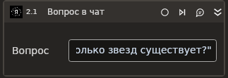

# Вопрос в чат

Отправляет вопрос в чат с YandexGPT.

Элемент **Вопрос в чат** должен размещаться в контейнере **Создать чат**. Убедитесь, что в контейнере указан действующий токен для запросов.

Элементы группы YandexGPT, включая **Вопрос в чат**, становятся доступными после установки в Студии библиотеки **Primo.AI.Linux**.

## Предварительные условия

Должен быть [создан и настроен чат](https://docs.primo-rpa.ru/primo-rpa/g_elements/el_extra/ai/yandexgpt/el_chat) с YandexGPT.

## Свойства
Символ `*` в названии свойства указывает на обязательность заполнения. Описание общих свойств см. в разделе [Свойства элемента](https://docs.primo-rpa.ru/primo-rpa/primo-studio/process/elements#svoistva-elementa).

| Свойство           | Тип                                 | Описание                                                                                           |
| ------------------ | ----------------------------------- | -------------------------------------------------------------------------------------------------- |
| **Запрос**          |                                     |                                            
| Вопрос*              | String                              |  Текст вопроса. |
| **Вывод**          |                                     |                                                                                                    |
| Ответ              | String                              | Переменная для хранения ответа YandexGPT. |
