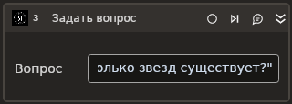

# Задать вопрос

Задает вопрос YandexGPT в асинхронном режиме. Используйте этот элемент, если ваш вопрос не требует срочного ответа. В асинхронном режиме генерация текста займет больше времени, но ответ будет качественнее и дешевле.

Элементы группы YandexGPT, включая **Задать вопрос**, становятся доступными после установки в Студии библиотеки **Primo.AI.Linux**.

## Предварительные условия

Для успешного создания чата вам потребуется знать [ID папки в Yandex Cloud и IAM-токен](https://docs.primo-rpa.ru/primo-rpa/primo-studio/settings/ai#yandexgpt).

## Свойства
Символ `*` в названии свойства указывает на обязательность заполнения. Описание общих свойств см. в разделе [Свойства элемента](https://docs.primo-rpa.ru/primo-rpa/primo-studio/process/elements#svoistva-elementa).

| Свойство           | Тип                                 | Описание                                                                                           |
| ------------------ | ----------------------------------- | -------------------------------------------------------------------------------------------------- |
| **YandexGPT**       |                                     |                                                                                                    |
| ID папки*             | String                              | Идентификатор папки в Yandex Cloud. Значение в виде переменной или константы.                                            |
| Токен*           | String                               | IAM-токен запроса, указывается в виде переменной или константы. Время жизни IAM-токена не превышает 12-ти часов, но рекомендуется запрашивать его каждый час. |
| Творчество*           | Double                               | Творческая составляющая ответа. В значении укажите число от 0 до 1. Чем выше значение, тем более непредсказуемым будет результат выполнения запроса. По умолчанию 0.5. |
| Макс. длина*           | Int32                               | Максимальная длина пары «запрос-ответ» в символах. По умолчанию 4000. Значение не должно превышать 4700 символов. |
| Тайм-аут*           | Int32                               | Максимальное время ожидания выполнения запроса. Указывается в миллисекундах, по умолчанию 20000. |
| **Запрос**          |                                     |                                                                                                    |
| Модель              | GenerationModelsNamesYabdexGpt                              |  Модель для генерации ответов. По умолчанию "Lite" |
| Вопрос*              | String                              |  Текст вопроса. |
| Роль*               | String                              |  Имя роли в чате. По умолчанию "system". |
| **Вывод**          |                                     |                                                                                                    |
| Ответ              | String                              | Переменная для хранения ответа YandexGPT. |
