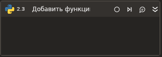

# Добавить функцию

Элемент выполняющий скрипт Python с возможностью загрузки скрипта из файла. Если указан и путь к файлу со скриптом Python и текст скрипта Python предпочтении отдается значению из файла.

### Свойства
Описание общих свойств элемента см. в разделе [Свойства элемента](https://docs.primo-rpa.ru/primo-rpa/primo-studio/process/elements#svoistva-elementa).\
Символ `*` в названии свойства указывает на обязательность заполнения.

| Свойство             | Тип                   | Описание                                      |
| -------------------- | --------------------- | --------------------------------------------- |
| ***Сценарий:***       | |  |
| Текст\*              | String    | Текст скрипта Python |
| Файл                 | String    | Путь к файлу со скриптом Python |
