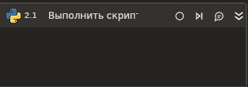

# Выполнить скрипт

Элемент выполняет скрипт Python.

### Свойства
Описание общих свойств элемента см. в разделе [Свойства элемента](https://docs.primo-rpa.ru/primo-rpa/primo-studio/process/elements#svoistva-elementa).\
Символ `*` в названии свойства указывает на обязательность заполнения.

| Свойство             | Тип                   | Описание                                      |
| -------------------- | --------------------- | --------------------------------------------- |
| ***Сценарий:***     | |  |
| Текст\*              | String   | Текст скрипта Python |
| Аргументы            | Dictionary<string, object> | Аргументы скрипта, если они имеются  |
